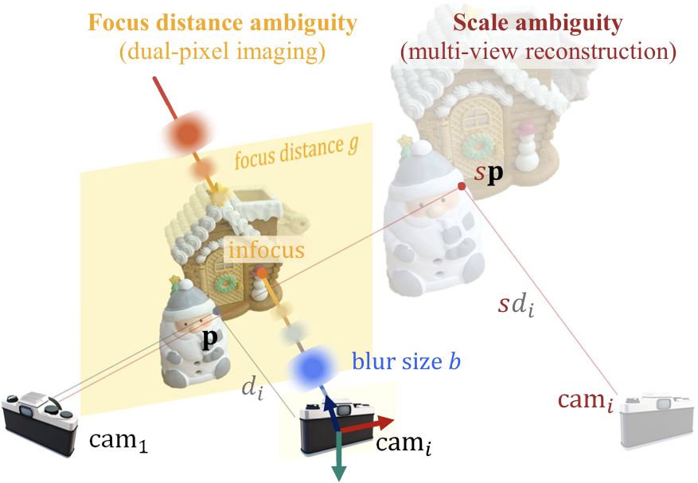

<table><tr><td align="center">

## DP-SfM: Dual-Pixel Structure-from-Motion without Scale Ambiguity

**[Lilika Makabe](https://lilika-makabe.github.io/)** · **Kohei Ashida** · **[Hiroaki Santo](https://sites.google.com/view/hiroaki-santo/)** · **[Fumio Okura](http://cvl.ist.osaka-u.ac.jp/user/okura/)** · **[Yasuyuki Matsushita](http://www-infobiz.ist.osaka-u.ac.jp/en/member/matsushita/)**

This is the official repository (pre-release) for our TPAMI paper: “DP-SfM: Dual-Pixel Structure-from-Motion without Scale Ambiguity”



</td></tr></table>

### 🌐 Project Page (TBA) | 📄 Paper (TBA) | 💻 Code & Data (upcoming)


## 🔔 News
- **2026-04-30**: Pre-release repository created. Code and data will be released soon.  


## 📝 Abstract
Multi-view 3D reconstruction (SfM + MVS) suffers from an unknown global scale ambiguity unless a reference object of known size is present. In this work, we show that **dual-pixel (DP) images** can automatically resolve the scale ambiguity **without requiring a reference object or prior calibration**. Specifically, DP defocus blur provides sufficient information to determine the absolute scale when paired with depth maps (up to scale) recovered from multi-view reconstruction. We propose a **simple linear method** to estimate absolute scale and per-view focus distances, followed by an **intensity-based optimization** stage that aligns left/right DP images via re-blurring with blur kernels. Experiments demonstrate the effectiveness of the proposed approach across diverse scenes captured with different cameras and lenses.


## Citation
```
@article{makabe_dpsfm_tpami,
  title   = {DP-SfM: Dual-Pixel Structure-from-Motion without Scale Ambiguity},
  author  = {Makabe, Lilika and Ashida, Kohei and Santo, Hiroaki and Okura, Fumio and Matsushita, Yasuyuki},
  journal = {IEEE Transactions on Pattern Analysis and Machine Intelligence},
  pubstate    = {Accepted for publication (to appear)},
  year    = {TBA}
}
```

